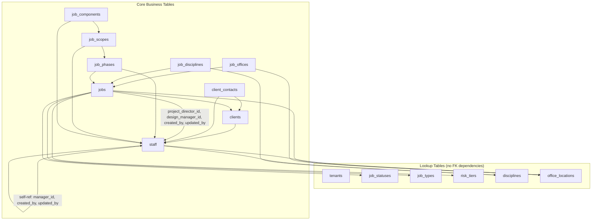

# Plinth — Schema Foreign Keys & Dependency Graph

## Table Dependency Graph

Tables must be created in this order due to foreign key dependencies. An arrow
`A → B` means "A references B" (B must exist before A can be created).



### Creation order (as implemented)

1. **Extensions** — `citext`, `pgcrypto`
2. **Trigger function** — `set_updated_at()`
3. **Lookup tables** — `tenants`, `job_statuses`, `job_types`, `risk_tiers`, `disciplines`, `office_locations`
4. **`staff`** — depends on `disciplines`, `office_locations`; self-referential FKs resolve within the same table
5. **`clients`** — depends on `staff` (audit columns)
6. **`client_contacts`** — depends on `clients`, `staff`
7. **`jobs`** — depends on `clients`, `staff`, `job_types`, `job_statuses`, `risk_tiers`, `office_locations`
8. **`job_offices`** — depends on `jobs`, `office_locations`
9. **`job_disciplines`** — depends on `jobs`, `disciplines`
10. **`job_phases`** — depends on `jobs`, `staff`
11. **`job_scopes`** — depends on `job_phases`, `staff`
12. **`job_components`** — depends on `job_scopes`, `staff`

---

## Bootstrap Tenant Pattern

### What it is

The UUID `00000000-0000-0000-0000-000000000001` is the bootstrap tenant, hardcoded
as the default value for `tenant_id` on every table. This enables the single-tenant
phase (Kirk Roberts Consulting only) without requiring JWT claims for every
database operation.

### How it works

- Every table's `tenant_id` column has `default '00000000-0000-0000-0000-000000000001'::uuid`
- RLS policies use `coalesce(jwt_claim, bootstrap_uuid)` — if no JWT is present, the bootstrap tenant is assumed
- The `tenants` table has a `CHECK (tenant_id = id)` constraint preventing one tenant from "owning" another

### How to remove it pre-launch (multi-tenant migration)

1. **Remove `tenant_id` defaults**: `ALTER TABLE <table> ALTER COLUMN tenant_id DROP DEFAULT;` for every table
2. **Replace RLS policies**: Remove the `coalesce` fallback. The expression becomes:
   ```sql
   tenant_id = (auth.jwt() -> 'app_metadata' ->> 'tenant_id')::uuid
   ```
3. **Create `seed_lookups_for_new_tenant(new_tenant_id uuid)`**: A function that copies all lookup rows from the bootstrap tenant to the new tenant. Without this, new tenants have empty lookup tables and the application breaks.
4. **Test**: Verify that unauthenticated requests receive zero rows (not bootstrap tenant rows)

---

## Bootstrap Staff Problem

### The problem

The first `staff` row in the bootstrap tenant has `created_by = NULL` and
`updated_by = NULL` because no staff member exists yet to be the creator.

### How the schema handles it

- `created_by` and `updated_by` on `staff` (and all business tables) are nullable FKs
- A SQL comment documents that nullability is for the bootstrap row only

### How application code handles it

- The bootstrap staff record is created during initial setup (manually or via a seed script)
- Application code enforces non-null `created_by` / `updated_by` for all subsequent inserts and updates
- The API layer should reject requests where these fields are missing, even though the database permits null
- An optional future migration can add `NOT NULL` constraints once the bootstrap row's audit columns have been backfilled

---

## `ON DELETE RESTRICT` Default & Junction Table Exceptions

### Default: `ON DELETE RESTRICT`

Every foreign key uses `ON DELETE RESTRICT` unless explicitly documented otherwise.
This means:

- You cannot delete a `client` that has `jobs` referencing it
- You cannot delete a `staff` member who is a `project_director_id` on any job
- You cannot delete a `discipline` that any `staff` member or `job_discipline` references
- Deletion must be handled by the application via "soft delete" (setting `is_active = false`) or by first removing all dependent references

### Exceptions: `ON DELETE CASCADE`

| FK Column | From Table | To Table | Justification |
|---|---|---|---|
| `job_offices.job_id` | `job_offices` | `jobs` | Junction row has no independent meaning |
| `job_offices.office_location_id` | `job_offices` | `office_locations` | Junction row has no independent meaning |
| `job_disciplines.job_id` | `job_disciplines` | `jobs` | Junction row has no independent meaning |
| `job_disciplines.discipline_id` | `job_disciplines` | `disciplines` | Junction row has no independent meaning |
| `job_scopes.phase_id` | `job_scopes` | `job_phases` | Scopes have no meaning without their phase. UI must not expose direct phase deletion; phases should be cancelled via status change. Cascade is a cleanup safety net, not an invitation. |
| `job_components.scope_id` | `job_components` | `job_scopes` | Components have no meaning without their scope. Same rationale as scopes→phases. |

---

## JWT `app_metadata` Pattern for Tenant Isolation

### How it works

1. When a user signs up or is invited, application code sets their `app_metadata` in Supabase Auth:
   ```json
   { "tenant_id": "00000000-0000-0000-0000-000000000001" }
   ```
2. Every authenticated request carries a JWT containing this claim
3. RLS policies extract the claim: `(auth.jwt() -> 'app_metadata' ->> 'tenant_id')::uuid`
4. Every query is filtered to only rows matching the user's tenant

### Single-tenant fallback

During the single-tenant phase, if no JWT claim is present (service role, Edge Functions,
direct psql), the `coalesce` expression falls back to the bootstrap tenant UUID. This
**must be removed** before multi-tenant launch.

### Security properties

- A user can never read, insert, update, or delete rows belonging to another tenant
- Even if application code has a bug, the database enforces isolation
- Service role bypasses RLS entirely (Supabase default) — use with extreme care

---

## Check Constraints Catalogue

| Table | Constraint | Expression | Business Rule |
|---|---|---|---|
| `tenants` | `tenants_self_reference` | `tenant_id = id` | A tenant row must own itself; prevents cross-tenant ownership |
| `tenants` | (inline) | `country_code IN ('NZ', 'AU', 'UK')` | Only NZ, AU, UK operations supported |
| `tenants` | (inline) | `currency_code IN ('NZD', 'AUD', 'GBP')` | Currency must match supported countries |
| `risk_tiers` | (inline) | `min_fee_value > 0` | Every risk tier must have a positive minimum fee threshold |
| `risk_tiers` | (inline) | `max_fee_value > 0` | When present, maximum must be positive |
| `risk_tiers` | `risk_tiers_fee_range` | `max_fee_value IS NULL OR max_fee_value > min_fee_value` | Maximum must exceed minimum when both are defined |
| `disciplines` | (inline) | `default_hourly_rate > 0` | Hourly rates must be positive |
| `office_locations` | (inline) | `country_code IN ('NZ', 'AU', 'UK')` | Offices only in supported countries |
| `staff` | (inline) | `role IN ('director', 'project_director', ...)` | Staff role restricted to 9 defined seniority levels |
| `staff` | (inline) | `hourly_cost_rate > 0` | When set, cost rate must be positive |
| `staff` | (inline) | `hourly_bill_rate > 0` | When set, bill rate must be positive |
| `clients` | (inline) | `status IN ('active', 'inactive')` | Client lifecycle limited to two states |
| `jobs` | (inline) | `fee_value >= 0` | Fee cannot be negative |
| `jobs` | (inline) | `project_risk_value >= 0` | Risk value cannot be negative |
| `job_phases` | (inline) | `estimated_hours >= 0` | Cannot estimate negative hours |
| `job_phases` | (inline) | `fee_amount >= 0` | Phase fee cannot be negative |
| `job_phases` | (inline) | `status IN ('not_started', 'in_progress', 'completed', 'on_hold')` | Phase lifecycle limited to four states |
| `job_components` | (inline) | `estimated_hours >= 0` | Cannot estimate negative hours |

### Business rule NOT enforced as a constraint

| Rule | Reason |
|---|---|
| `jobs.fee_value > jobs.project_risk_value` | Application must allow saving with an acknowledged override. Detected by application code, not the database. |
